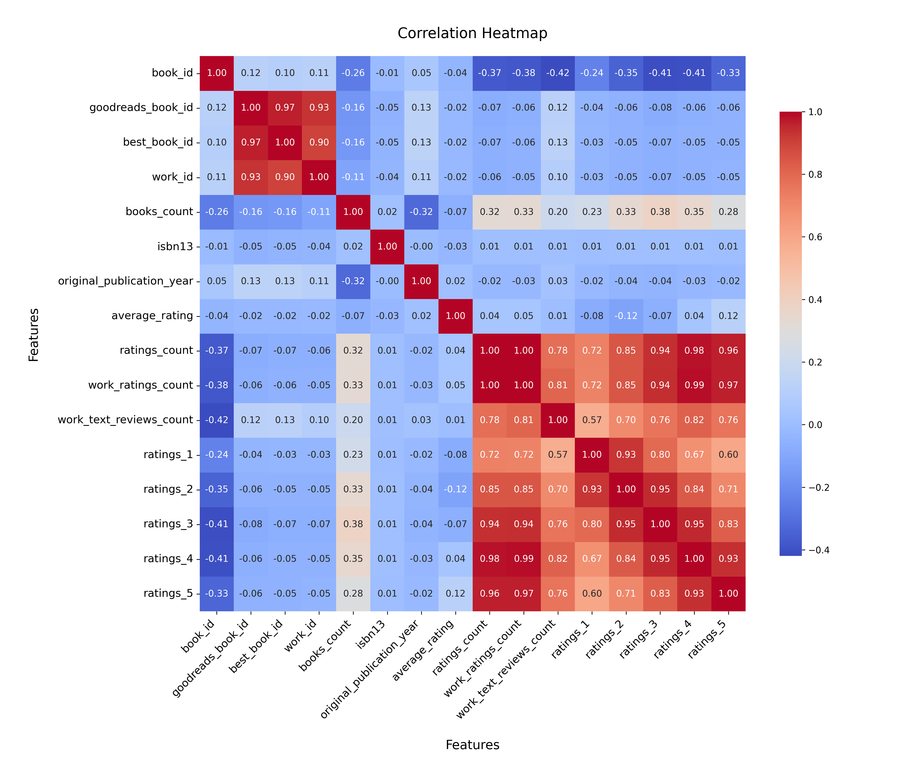
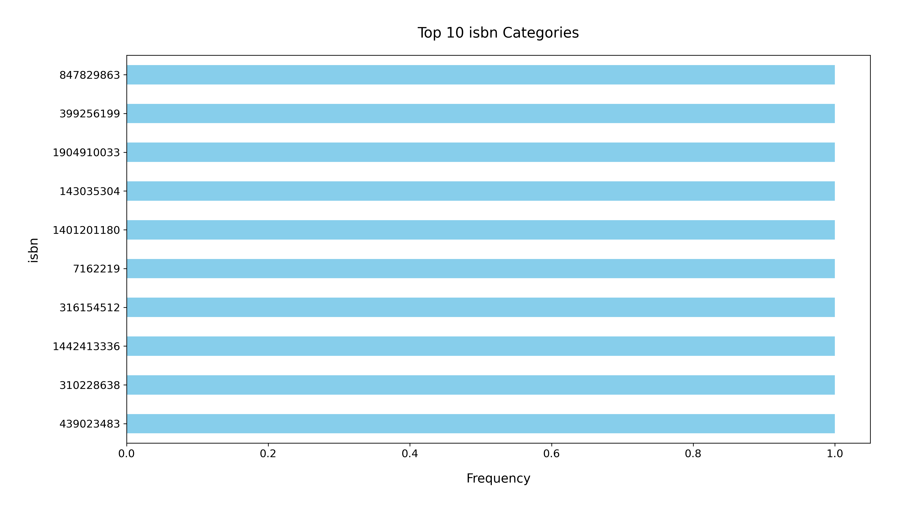

# Analysis Report

The analysis of the Goodreads dataset reveals a wealth of information about book attributes, user ratings, and publication details. This comprehensive dataset consists of 10,000 entries, with various features such as authorship, publication year, ISBN numbers, ratings distributions, and review counts that allow for a detailed exploration of the reading preferences and behaviors of users on the platform. Below, we summarize key insights derived from the data, highlighting trends, anomalies, and potential avenues for further exploration.

