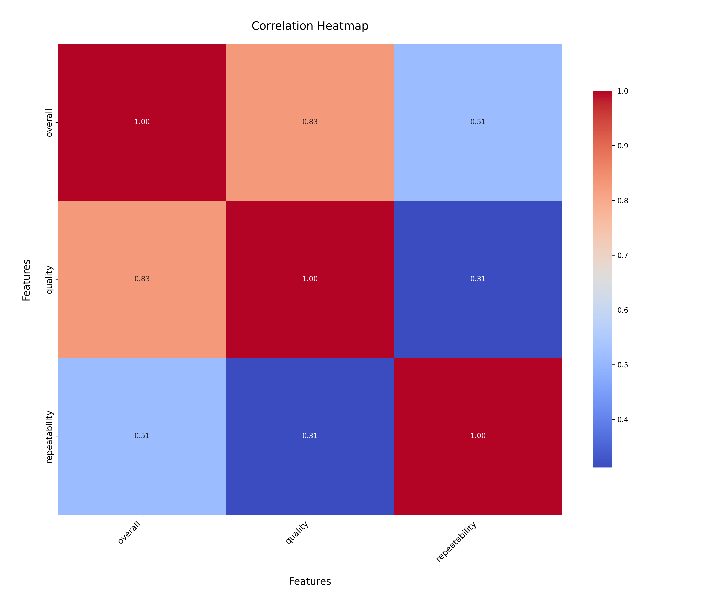
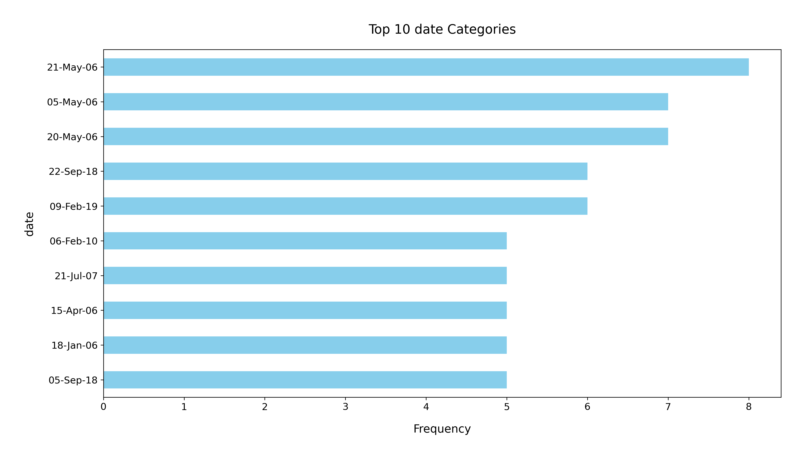

# Analysis Report

### Dataset Summary

The dataset `media.csv` contains information about media titles with a total of 2,652 entries and 8 columns. The columns include:

- **date**: The release date of the media.
- **language**: The language of the media.
- **type**: The type of media (e.g., movie, series).
- **title**: The title of the media.
- **by**: The creator or author of the media.
- **overall**: A numerical rating of the media on a scale (presumably 1 to 5).
- **quality**: A numerical assessment of the media's quality on a similar scale.
- **repeatability**: A measure of how often the media can be revisited, also on a defined scale.

### Key Insights

1. **Missing Values**: 
   - The dataset has missing entries for the `date` column (99 missing) and the `by` column (262 missing). This indicates a potential issue with data completeness, particularly in identifying who created the media.
  
2. **Language Distribution**: 
   - There are 11 unique languages in the dataset, with 'English' being the most frequent (1,306 instances). This suggests a heavy representation of English-language media.

3. **Media Types**: 
   - The predominant type is 'movie', which accounts for 2,211 entries. This indicates that the dataset is heavily skewed towards films rather than other media types (e.g., series, documentaries).

4. **Title Variety**: 
   - There are 2,312 unique titles, suggesting a rich diversity in content. However, some titles have higher frequencies, with 'Kanda Naal Mudhal' being the most frequent at 9 occurrences.

5. **Rating Metrics**: 
   - The `overall` rating has a mean of approximately 3.05, indicating a generally positive assessment, while the `quality` rating has a mean of about 3.21. 
   - The `repeatability` metric has a mean of 1.49, suggesting that most media is not frequently revisited, with the majority rated as 1.

### Recommendations

1. **Address Missing Values**: 
   - Investigate the missing values in the `date` and `by` columns. Depending on the analysis goals, consider imputation strategies or removal of incomplete rows to maintain data integrity.

2. **Expand Language Representation**: 
   - Given the dominance of English-language media, consider expanding the dataset to include more titles in other languages to provide a more balanced view of media diversity.

3. **Diverse Media Types**: 
   - Explore the inclusion of other types of media (e.g., series, documentaries) to enrich the dataset and provide insights across different formats.

4. **Analyze Rating Distributions**: 
   - Further analyze the distribution of ratings to understand what contributes to higher overall and quality ratings. Visualizations like histograms or boxplots could provide clarity on rating distributions.

5. **Investigate Repeatability**: 
   - The low repeatability score suggests that viewers may not find the media engaging enough to revisit. Conducting surveys or user feedback analysis could provide insights into improving content for higher viewer retention.

### Conclusion

The `media.csv` dataset offers valuable insights into media content, particularly films. However, addressing missing values and incorporating a broader range of languages and media types could enhance its utility for analysis. Further examination of ratings and viewer engagement will also provide actionable insights for content creators and distributors.

